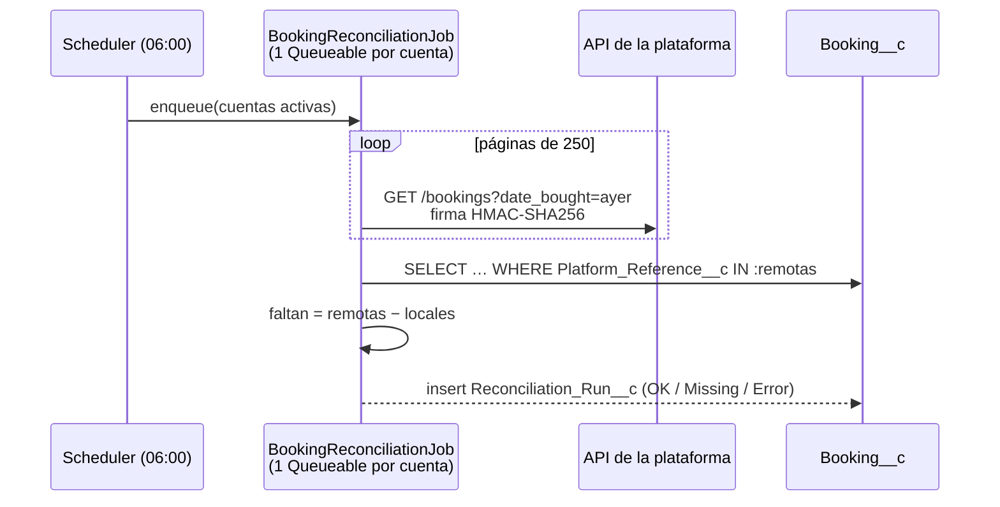

# Salesforce Booking Ops

Automatizaciones **Apex** para la operativa de reservas de una agencia de turismo que vende entradas a monumentos a través de varias plataformas: Regiondo, FareHarbor, Turitop y venta directa.

Son seis piezas independientes, extraídas de un CRM en producción y **reescritas para su publicación**. Cada una explica qué problema real tenía la versión original y cómo se ha resuelto.

  

| Módulo | Tipo | Qué resuelve |
|---|---|---|
| [Conciliación diaria](#1-conciliación-diaria-de-ventas) | Schedulable + Queueable con callouts | Detecta ventas que no llegaron a Salesforce antes de que el cliente se presente sin entrada. |
| [Enrutado de incidencias](#2-enrutado-de-incidencias-y-reseñas) | Trigger + handler | Mueve cada incidencia a la cola del equipo que lleva el producto del cliente y convierte las reseñas en `Review__c`. |
| [Migración de ficheros](#3-migración-de-ficheros-a-tickets) | Batch | Mueve las entradas adjuntas de las reservas a su `Ticket__c`, sin duplicar almacenamiento. |
| [Agrupación de compras](#4-agrupación-de-compras) | Trigger + servicio | Agrupa las reservas que se pueden comprar juntas al proveedor (mismo producto, ventana de N minutos, máximo por grupo) y avisa cuando un grupo está listo. |
| [Webhook de reservas OCTO](#6-webhook-de-reservas-octo-ventrata-bókun) | REST entrante | Recibe altas, cambios y cancelaciones de las plataformas que usan el estándar OCTO (Ventrata, Bókun…). Es idempotente y tolera eventos fuera de orden. |
| [Turnos en el punto de encuentro](#5-turnos-en-el-punto-de-encuentro) | Servicio `@AuraEnabled` | Tótem de bienvenida y panel del personal: turnos por área sin números duplicados aunque haya varios tótems. |

## 1. Conciliación diaria de ventas



- [`BookingPlatform`](force-app/main/default/classes/BookingPlatform.cls) es una interfaz común. [`RegiondoPlatform`](force-app/main/default/classes/RegiondoPlatform.cls) la implementa con paginación y firma HMAC; para añadir otra plataforma basta con otra clase.
- Hay una ejecución por cuenta, encadenada, de modo que cada cuenta tiene sus propios límites de callouts.
- Las referencias se buscan **por valor y no por fecha de creación**: si una venta de ayer entra hoy por un reintento del webhook, no se cuenta como perdida.
- El resultado queda en `Reconciliation_Run__c`, sobre el que se pueden montar informes, dashboards y alertas.

**Respecto al original:** las claves de API de 14 cuentas estaban escritas en el código y pasan a `Booking_Platform_Account__mdt`. El JSON ya no se parsea con una regex sobre `"order_number"`. Los errores se registran en lugar de quedarse en `System.debug`. Y el cruce deja de depender de una ventana horaria con un desfase de zona horaria fijado en el código.

## 2. Enrutado de incidencias y reseñas

[`CaseRoutingHandler`](force-app/main/default/classes/CaseRoutingHandler.cls) + [`CaseTrigger`](force-app/main/default/triggers/CaseTrigger.trigger)

- **Before insert/update:** las incidencias que entran en la cola genérica `Urgent_Incidents` se asignan a la cola del producto de la última reserva del cliente, buscada por email sin distinguir mayúsculas. La relación producto → cola está en `Case_Routing_Rule__mdt`.
- **After insert:** los casos marcados como reseña cuyo asunto es el número de una reserva generan un `Review__c` enlazado a la reserva, el producto y el caso.

**Respecto al original:**

| Antes | Ahora |
|---|---|
| IDs de cola fijados en el código (distintos en cada sandbox) | Nombres de cola en Custom Metadata |
| 1 SOQL por cola (10 por ejecución) | 1 consulta para todas las colas, constante con 1 o 200 casos (lo verifica un test) |
| `update` de `Trigger.new` dentro de un *before trigger* (error en tiempo de ejecución) | Se asigna `OwnerId` directamente, sin DML |
| `if/else` con 10 ramas por producto | Un `Map` construido a partir de las reglas |

## 3. Migración de ficheros a tickets

[`BookingFileMigrationBatch`](force-app/main/default/classes/BookingFileMigrationBatch.cls): para las reservas **futuras** de los productos indicados, mueve sus ficheros al `Ticket__c` de "Entrada". Crea el nuevo `ContentDocumentLink` **antes** de borrar el antiguo, así que si algo falla el fichero nunca queda huérfano. Los productos se pasan por parámetro en lugar de estar fijados como IDs en el constructor.

```apex
Database.executeBatch(new BookingFileMigrationBatch(new Set<Id>{ '01t...' }), 50);
```

## 4. Agrupación de compras

[`PurchaseGroupingService`](force-app/main/default/classes/PurchaseGroupingService.cls) + [`BookingTrigger`](force-app/main/default/triggers/BookingTrigger.trigger)

Muchos proveedores venden entradas de grupo, o el operador compra varias reservas en un solo pedido. Las reglas viven en `Purchase_Grouping_Rule__mdt`; por ejemplo, el producto `GUIDED` admite un máximo de 3 reservas por grupo en una ventana de 60 minutos.

- Cada reserva **confirmada** entra en el primer grupo abierto de su producto cuya ventana la incluya. Si no hay ninguno, abre uno nuevo anclado a su hora. Al llegar al máximo, el grupo pasa a `Full`, y esa es la lista de compras pendientes.
- Si una reserva se cancela o cambia de producto, hora o número de asistentes, **libera su plaza** y el grupo se reabre. Los grupos ya **comprados** quedan congelados.
- `toCsv(groupId)` genera el pedido para el proveedor y neutraliza las fórmulas (`=…`) para que no se ejecuten al abrirlo en Excel.

**Respecto al original:**

| Antes | Ahora |
|---|---|
| Recorría **todas** las reservas de la historia en cada ejecución (`WHERE GrupoCompra__c != null`) | Solo carga los grupos abiertos que se solapan con el lote |
| Un SOQL por grupo dentro de un bucle (límite de 101 consultas con unos 100 grupos) | Número de consultas constante: el test inserta 200 reservas y verifica que se hacen como mucho 5 |
| Grupos como un entero global (`GrupoCompra__c = max + 1`) | Objeto `Purchase_Group__c` con ventana, capacidad, asistentes y estado |
| Dos inserciones simultáneas podían llenar un grupo por encima de su máximo | `FOR UPDATE` sobre los grupos abiertos |
| Agrupación manual en una página Visualforce que leía un informe cuyo ID estaba fijado en el código | Asignación automática, con exportación CSV del grupo |

## 5. Turnos en el punto de encuentro

[`ServiceQueueService`](force-app/main/default/classes/ServiceQueueService.cls)

En el punto de encuentro, el cliente teclea su número de reserva en un tótem y elige servicio (audioguías, grupos, devoluciones…). El personal pulsa "Llamar siguiente" en su área.

- `checkIn(reserva, área)` devuelve un turno por área y día (`G-014`) y cuántas personas tiene delante. Pulsar dos veces no genera dos turnos.
- `callNext(área)` llama al turno más antiguo en espera y registra quién lo atendió y cuándo. `nowServing()` alimenta la pantalla de llamadas.
- La numeración bloquea el contador del área y del día con `FOR UPDATE`, y su clave es única: dos tótems a la vez nunca reciben el mismo número.

Los métodos son `@AuraEnabled` y se pueden usar desde un LWC o una página de Experience Cloud en modo kiosco. En producción la interfaz era Visualforce.

## 6. Webhook de reservas OCTO (Ventrata, Bókun…)

[`OctoBookingWebhook`](force-app/main/default/classes/OctoBookingWebhook.cls): `POST /services/apexrest/octo/bookings`

[OCTO](https://www.octo.travel/) es el estándar abierto de la industria para conectar plataformas de reserva de actividades y entradas. La plataforma envía cada evento y Salesforce lo convierte en un `Booking__c`.

- **Idempotente**: hace upsert por el `uuid` de la reserva. Si un evento llega repetido, no duplica nada.
- **Eventos fuera de orden**: si llega un `booking.confirmed` *anterior* a un `booking.cancelled` ya aplicado, se descarta, así que una reserva cancelada no "resucita".
- **Mapeo de productos por metadatos** (`Product_Mapping__mdt`): `productId`, con un `optionId` opcional, se traduce al `ProductCode` de Salesforce. Una regla para una opción concreta tiene prioridad sobre la regla genérica del producto. Si un producto no tiene mapeo, la reserva se guarda igualmente y el evento queda como *Warning*.
- **Auditoría**: cada evento se registra en `Webhook_Event__c` con su resultado (Applied, Warning, Ignored, Rejected o Error), el motivo y el payload.
- **Seguridad**: el secreto compartido se guarda solo como hash SHA-256 en Custom Metadata.
- La reserva creada pasa por el trigger de `Booking__c`, así que entra directamente en la **agrupación de compras** (módulo 4).

**Respecto al borrador original:** el borrador tenía el secreto escrito en el código (`'secreto_compartido'`) y comparaba cadenas. Usaba `DateTime.valueOfGmt` con fechas ISO 8601 (`…T10:30:00Z`), que **lanza una excepción con cualquier evento real**. Además, los mapas de productos y estados estaban fijados en el código, y el upsert se hacía por `resellerReference`, que puede venir vacío.

## Modelo de datos

```
Booking__c ─┬─< Ticket__c
            ├─< Review__c >── Case (Is_Review__c, Booking__c)
            ├─< Service_Queue_Ticket__c       turnos (Service_Queue_Counter__c por área/día)
            ├─< Webhook_Event__c              auditoría de webhooks
            ├── Purchase_Group__c ── Product2
            └── Product2
Reconciliation_Run__c                      resultados de conciliación
Booking_Platform_Account__mdt (Protected)  cuentas y claves por plataforma
Case_Routing_Rule__mdt                     subfamilia de producto → cola
Purchase_Grouping_Rule__mdt                producto → máximo por grupo y ventana
Product_Mapping__mdt                       producto/opción externo → ProductCode
Webhook_Setting__mdt                       hash del secreto de cada webhook
```

## Tests

Cada clase tiene su test, con mocks HTTP y datos masivos:

- La conciliación se prueba con 300 pedidos en 2 páginas: comprueba la firma de cada petición, detecta los 2 que faltan e ignora las referencias de otras plataformas.
- El enrutado se prueba con 102 casos para verificar el número constante de consultas, junto con el caso sin regla y el caso sin reserva.
- La agrupación de compras cubre la ventana, la capacidad, el orden de llegada, la cancelación que reabre el grupo, los grupos comprados congelados, 200 reservas con consultas constantes y el escapado del CSV.
- El webhook OCTO cubre la creación con fechas ISO 8601, la prioridad del mapeo por opción, la idempotencia, la cancelación, los eventos fuera de orden, el secreto incorrecto o ausente, los errores de JSON y de estado, los eventos ignorados y el producto sin mapear.
- Los turnos cubren la numeración por área, la idempotencia, el orden de llamada y la cola vacía.
- La migración comprueba que los ficheros se mueven y no se copian, y que no se tocan las reservas pasadas, las de otros productos ni las que no tienen ticket.

```bash
sf project deploy start --target-org <alias> --test-level RunLocalTests
npm run lint    # sintaxis y formato de todo el Apex (también en CI)
```

## Licencia

[MIT](LICENSE)
